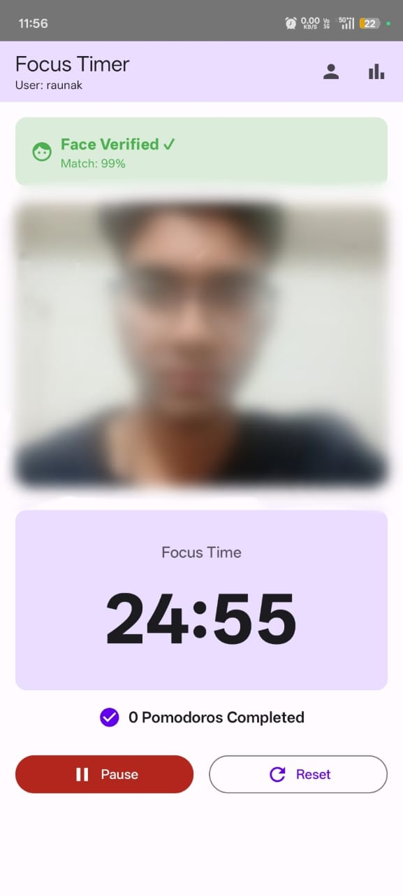
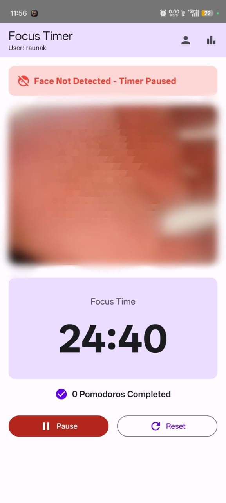

# FocusTimer ⏳📱

A simple and clean **Focus Timer Android app** (Pomodoro-style) to help you stay productive and manage deep work sessions.

---

## ✨ Features

- ⏱️ Focus timer (work session timer)
- 🔁 Break timer support (short/long break)
- ▶️ Start / Pause / Reset controls
- 🔔 Notification / alarm when timer ends (if enabled)
- 🎨 Simple UI and smooth user experience

---

## 📸 Screenshots





---

## 🛠️ Tech Stack

- **Language:** Java
- **IDE:** Android Studio  
- **UI:** Jetpack Compose / XML 
- **Build System:** Gradle

---

## ✅ Requirements

- Android Studio (latest recommended)
- JDK 17+
- Android SDK
- Minimum Android version: **Android 7.0 (API 24)**

---

## 🚀 Setup & Run (Android Studio)

1. Clone the repository:
   ```bash
   git clone https://github.com/<your-username>/FocusTimer.git
Open in Android Studio:

File → Open → Select project folder

Let Gradle sync complete ✅

## Run the app:

Click Run ▶️ and select emulator / device

## 📦 Build APK
To generate APK:

Android Studio → Build → Build Bundle(s) / APK(s) → Build APK(s)

APK will be located at:

app/build/outputs/apk/debug/app-debug.apk

## 🧾 Project Structure


FocusTimer/
│── app/
│   └── src/                # Application source code
│── gradle/
│── build.gradle(.kts)
│── settings.gradle(.kts)
│── gradlew
│── gradlew.bat
│── .gitignore

## 🤝 Contributing

Pull requests are welcome!
For major changes, please open an issue first to discuss what you would like to change.

## 📜 License

You are free to use, modify, and distribute it.

## 👨‍💻 Author

Yash Rajput
GitHub: Raunak-24
